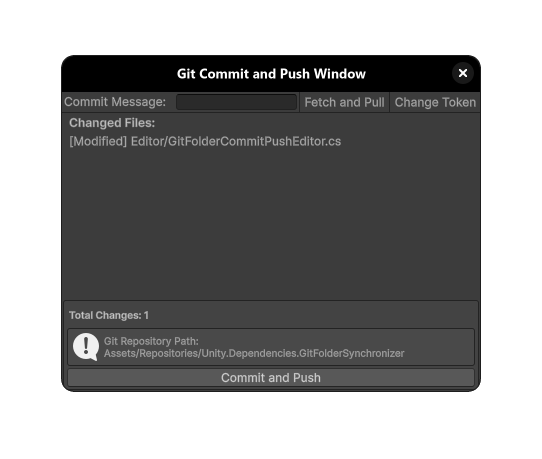

# Unity Essentials

**Unity Essentials** is a lightweight, modular utility namespace designed to streamline development in Unity. 
It provides a collection of foundational tools, extensions, and helpers to enhance productivity and maintain clean code architecture.

## 📦 This Package

This package is part of the **Unity Essentials** ecosystem.  
It integrates seamlessly with other Unity Essentials modules and follows the same lightweight, dependency-free philosophy.

## 🌐 Namespace

All utilities are under the `UnityEssentials` namespace. This keeps your project clean, consistent, and conflict-free.

```csharp
using UnityEssentials;
```

# Unity Essentials – Dependencies: Git Folder Synchronizer

A tiny editor utility that adds convenient Assets menu actions to fetch/pull and commit/push a Git repository directly from the Unity Project window.

- Context-aware: works on the currently selected folder; any folder inside a Git repo is valid
- Simple review UI: lists changed files and lets you enter a commit message
- Push via HTTPS token stored in EditorPrefs



## Requirements
- Unity: 6.0 (per `package.json`) or newer
- Git CLI installed and available on the system PATH
- Editor-only (wrapped in `#if UNITY_EDITOR`)

## Menu commands
- Assets > Git Fetch and Pull
  - Runs `git fetch` then `git pull` in the selected folder’s repository
  - Only enabled when the selection is inside a Git repo (has a `.git` folder at or above the selected folder)
- Assets > Git Commit and Push
  - Opens a small utility window listing changed files (from `git status --porcelain`)
  - Lets you enter a commit message, then runs: `git add .`, `git commit -m "…"`, and `git push`
  - Only enabled if there are uncommitted changes

Selection logic: select any folder (or asset inside a folder) in the Project window; the tool resolves the on-disk path and runs Git commands there. If you select a subfolder within a repo, Git still runs fine in that subdirectory.

## Authentication (HTTPS token)
Push uses a personal access token (PAT) stored in EditorPrefs under the key `GitToken`.

Tips
- GitHub token scopes: usually `repo` is enough for private repos; for public repos, narrower scopes may suffice.
- Security: EditorPrefs stores the token in your user profile; treat it like a password. Prefer per-user setup; don’t commit tokens.
- If your remote is SSH, the tool will log an error for push. You can still use Fetch/Pull, or switch your remote to HTTPS.

## How it works (under the hood)
- Fetch/Pull
  - `git fetch` followed by a check for “behind” status via `git status --porcelain -b` and then `git pull` if needed
- Commit/Push
  - Gathers changes via `git status --porcelain`
  - Stages everything with `git add .`
  - Commits with your message (accepts empty messages, though not recommended)
  - Pushes to `origin` using an authenticated HTTPS URL constructed with the token

## Usage
1) Ensure Git is installed and reachable from your shell/terminal.
2) In the Project window, select a folder inside the repo you want to operate on.
3) For pulling remote changes:
   - Use Assets > Git Fetch and Pull
   - If the branch is behind, the tool runs `git pull` and logs the result.
4) For committing and pushing your changes:
   - Use Assets > Git Commit and Push
   - Review the changed files list and enter a commit message
   - Click “Commit and Push” to stage, commit, push, and then fetch

## Notes and limitations
- Staging: the tool uses `git add .` and commits all current changes in the selected repository path
- Partial commits: not supported via the UI; use your Git client if you need fine-grained staging
- Remotes: push targets `origin` and the current HEAD; multiple remotes or custom refs aren’t exposed in the UI
- SSH remotes: push is not supported (HTTPS only for push)
- Commit message: empty messages are allowed but discouraged; provide a meaningful message when possible

## Troubleshooting
- “No repository selected.”
  - Ensure you’ve selected a folder within a Git repository (a `.git` directory exists at or above the path)
- “Git not found” or commands do nothing
  - Verify Git is installed and on your PATH; try running `git --version` from your OS shell
- “No Git token configured in EditorPrefs” or push fails with auth errors
  - Set `EditorPrefs.SetString("GitToken", "<token>")`; ensure the remote is HTTPS and the token is valid
- “SSH remote detected - use SSH keys instead of tokens”
  - Switch remote to HTTPS for push or handle push outside of this tool
- Pull leads to conflicts
  - Resolve merge conflicts using your Git client; the tool doesn’t provide conflict resolution UI

## Files in this package
- `Editor/GitFolderFetchPull.cs` – Adds the Fetch & Pull command and behind-check logic
- `Editor/GitFolderCommitPushEditor.cs` – Small review window showing changed files and commit message input
- `Editor/GitFolderCommitPush.cs` – Core commit/push helpers (stage/commit/push, change listing, basic changelog stub)
- `Editor/GitFolderSynchronizer.cs` – Shared helpers (run git, token handling, selection path)
